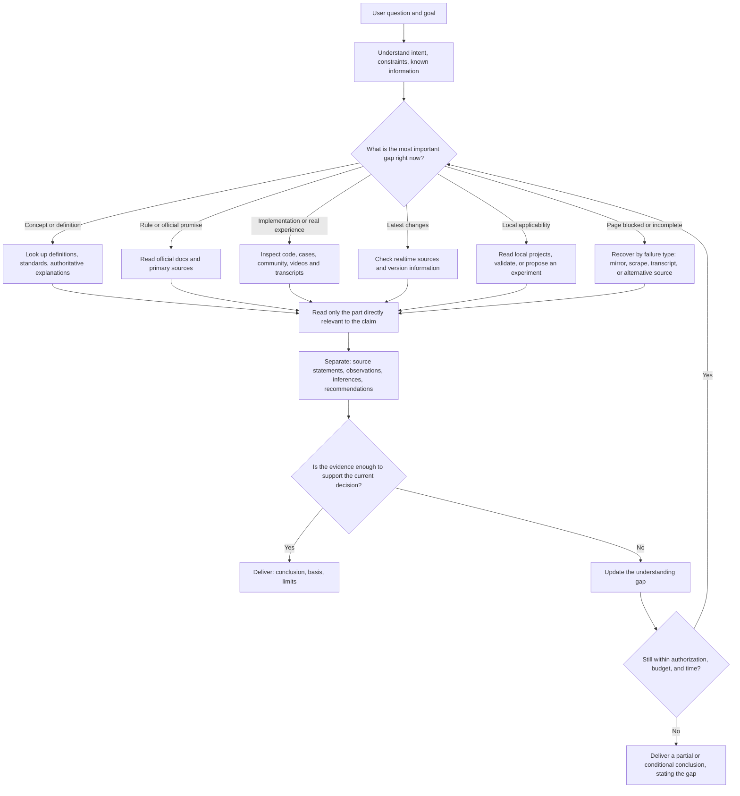

# Research Pro

> **Language:** English (default) · [中文](README.zh-CN.md)

**Help AI actually research a question through to the end — not just hand you a pile of links.**

Research Pro is an intent-centric research skill for AI agents. It first understands what you are trying to do, then determines what is actually missing: a concept, a rule, the latest changes, real-world experience, an implementation, conflicts between sources, or a local validation.

It will not declare "research complete" just because it found one search result, and it will not keep searching to satisfy a fixed number of rounds. It tells you what can be established now, on what basis, what remains unknown, and which validation is most valuable next.

## When to use it

Good fits:

- "Is this tool or product a good fit for us?"
- "What are the real differences between these options, and how should we choose?"
- "What does this concept, rule, or official statement actually mean?"
- "What happened recently, and which changes can be confirmed?"
- "The official docs say this — does real-world use have pitfalls?"
- "I've found some material but don't know what is trustworthy or what is missing."

Not needed:

- A simple, stable fact lookup;
- Summarising a link or file you already provided;
- A task that is directly about changing code rather than researching options or evidence.

## How it works

Research Pro does not force every question through one fixed workflow. It picks the next step from the current understanding gap, then re-judges as new evidence arrives.



The point of this diagram is the loop in the middle: after new information arrives, you may need to go back and redefine the question — or you may find you already have enough and stop searching.

## What each kind of material can and cannot answer

| Material or method | Good for answering | Does not by itself prove |
|---|---|---|
| Local files, code, history | The current state of the project; what was already decided | Anything about the outside world's latest state |
| Official docs, standards, publisher material | Definitions, rules, support scope, official promises | Real-world performance, or fitness for your case |
| Papers and technical reports | Mechanisms, methods, experimental results, research boundaries | That your local environment will reproduce them |
| GitHub, cases, developer communities | Actual implementations, edge cases, maintenance, pitfalls | That one experience generalises into a general rule |
| Community discussion (Reddit etc.) | Problems users hit, failure modes, alternatives | Direct access may be blocked; posts are not independent validation |
| YouTube and transcripts | Demonstrations, explanations, interviews, usage context | Reading a transcript is not watching the whole video; a clip is not the whole talk |
| Realtime sources | Recent releases, changes, current state | Check date, version, and source stability |

Source type is an entry point, not an evidence grade. What matters is whether it directly answers the current claim, traces back to the original, matches the conditions, and whether independent challenge or local validation is needed.

If a page is refused, only an abstract is available, or the body is truncated, Research Pro first decides whether the gap could change the conclusion, then picks the matching recovery path. A failed recovery becomes part of the conclusion — a link or a search snippet is never disguised as evidence.

## What counts as "good enough"

A strong reference is neither the word "official" nor "found many times". It must at least:

1. directly address the claim being judged;
2. trace to the original text, code, data, or a clear experimental method;
3. have appropriate credibility for its field;
4. match your conditions, version, timeline, and scenario;
5. for high-stakes decisions, also check counterevidence, independent experience, or local validation.

So the final answer may be "yes", "yes with conditions", or "cannot be confirmed yet" — rather than a forced conclusion that merely looks certain.

## What you get

Usually four parts:

- the direct answer or the most reasonable decision right now;
- the sources and exact locations that support it;
- disputes, version, access-scope, and evidence limits;
- what is still unknown, and the most valuable next validation.

## Ask directly, like this

```text
Research this for me: is this tool a good fit for our team? Understand our use case first, then check official capabilities, real-world experience, maintenance risk, and limits, and give an evidence-based recommendation.
```

```text
Research this for me: are SQLite foreign key declarations enforced by default? Give the official basis and tell me how to verify it on an actual connection.
```

An incomplete question is fine. Research Pro fills in the concepts or facts that most affect the judgement first, and only asks a targeted question when a missing user preference would change the route.

## Install and check

```bash
git clone https://github.com/mfang0126/research-pro.git
cd research-pro
bash scripts/install.sh
```

If your host already provides working web search, script API keys may not be needed. To use script-based search, put at least one supported provider key into the private config file, then run:

```bash
node scripts/doctor.mjs --require-ready --json
```

Full installation, credentials, and host integration: see [SETUP.md](SETUP.md).

## For maintainers

- [SKILL.md](SKILL.md): proactive research guidance and evidence boundaries;
- [references/operations.md](references/operations.md): retrieval, access recovery, budgets, stopping, and run records;
- `skills/research-pro/`: mirror entry for other hosts;
- `.diagram/`: Mermaid source for the README flowchart;
- `node evals/validate_contract_gate.mjs --require-mirror`: checks the public packaging and mirror consistency.

Passing the checks means the packaging and runtime layers meet the current constraints; it does not mean every website, backend, or future model answer is correct. Research Pro keeps those access limits and unknowns in the final answer.

## Version

`3.21.0-mf` — search-tool orchestration policy (capability catalog, provider chains, P0–P6 ladder, per-task budget defaults) plus the optional Jev pre-judgment layer (jev_plan / jev_rank).
