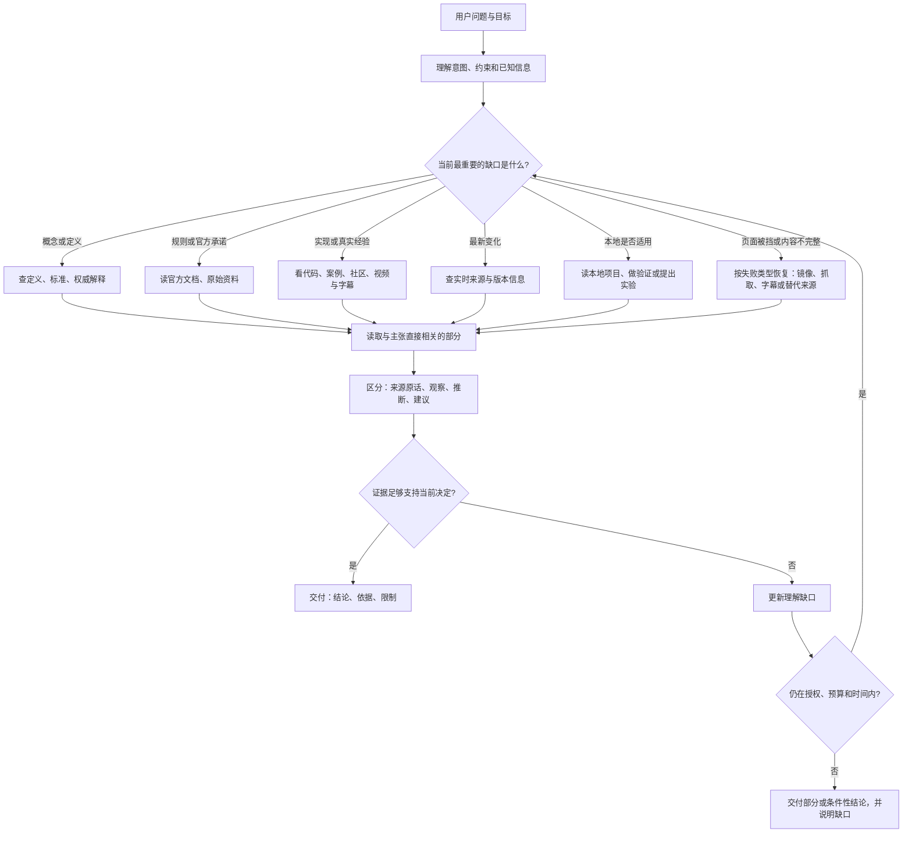

# Research Pro

> 中文 · [English](README.md)（默认）

**让 AI 真正把问题研究明白，而不是只给你一堆链接。**

Research Pro 是一个给 AI agent 使用的、以意图为中心的研究 skill。它会先理解你想做什么，再判断当前真正缺的是什么：是概念、规则、最新变化、真实使用经验、代码实现、来源之间的冲突，还是本地验证。

它不会因为找到一个搜索结果就宣布“研究完成”，也不会为了凑固定轮数一直搜索。它会告诉你现在能确定什么、依据是什么、哪些地方仍然未知，以及下一步最有价值的验证是什么。

## 什么时候用

适合这些问题：

- “这个技术或产品适不适合我们？”
- “几个方案有什么真实差异，应该怎么选？”
- “这个概念、规则或官方说法到底是什么意思？”
- “最近发生了什么，哪些变化已经可以确认？”
- “官方文档这样说，真实使用有没有坑？”
- “我已经搜到一些东西，但不知道哪些可信、还缺什么？”

不需要 Research Pro 的情况：

- 只想查一个简单、稳定的事实；
- 只需要总结一个已经提供的链接或文件；
- 任务本身是直接改代码，而不是先研究方案或证据。

## 它是怎么工作的

Research Pro 不把每个问题都套进同一条固定流程。它根据当前的理解缺口选择下一步，然后根据新证据重新判断。



这张图的重点是中间的回路：搜到新信息后，可能需要回头重新定义问题，也可能发现已经足够回答，不再继续搜索。

## 不同资料各自解决什么问题

| 资料或方式 | 适合回答 | 不能自动证明 |
|---|---|---|
| 本地文件、代码和历史记录 | 当前项目到底是什么状态，过去已经决定了什么 | 不能代表外部世界的最新情况 |
| 官方文档、标准、发布者资料 | 定义、规则、支持范围和官方承诺 | 不能单独证明真实效果或适合你的场景 |
| 学术论文和技术报告 | 机制、方法、实验结果和研究边界 | 不能自动证明本地环境一定复现 |
| GitHub、案例和开发者社区 | 实际实现、边缘情况、维护和踩坑经验 | 不能把个别经验推广成普遍结论 |
| Reddit 等社区讨论 | 用户遇到的问题、失败模式和替代方案 | 直接访问可能被 block，帖子观点也不是独立验证 |
| YouTube 与字幕/转录 | 演示过程、讲解、访谈和使用上下文 | 只读字幕不等于看过完整画面，片段不代表整段视频 |
| 实时来源 | 最近发布、变化和当前状态 | 需要检查日期、版本和来源稳定性 |

来源类型只是检索入口，不是证据等级。真正重要的是它是否直接回答当前主张、能否追溯到原文、条件是否匹配，以及是否有必要的独立挑战或本地验证。

如果页面被拒绝、只能拿到摘要、正文被截断，Research Pro 会先判断这个缺口是否会改变结论，再选择对应的恢复路径。恢复失败会成为结论的一部分，不会把一个链接或搜索摘要伪装成证据。

## 什么才算“够好”

一个强参考不是“官方”三个字，也不是“搜到了很多次”。它至少要满足：

1. 直接对应当前要判断的主张；
2. 能追溯到原文、代码、数据或明确的实验方法；
3. 来源或方法在这个领域有相应可信度；
4. 条件、版本、时间和你的场景相符；
5. 对高风险决定，还要检查反面证据、独立经验或本地验证。

因此最终回答可能是“可以”“有条件可以”“目前不能确认”，而不是强行给一个看起来确定的结论。

## 你会得到什么

通常会得到四部分：

- 直接回答或当前最合理的决定；
- 支撑它的来源和具体位置；
- 争议、版本、访问范围和证据限制；
- 仍然未知，以及最值得做的下一步验证。

## 直接这样问

```text
帮我研究：这个工具适不适合我们团队？先理解我们的使用场景，再查官方能力、真实使用经验、维护风险和限制，最后给出有依据的建议。
```

```text
帮我研究：SQLite 外键声明是否默认生效？请给官方依据，并告诉我如何在实际连接上验证。
```

问题还不完整也可以直接开始。Research Pro 会先补齐最影响判断的概念或事实；只有缺少的用户偏好会改变路线时，才会问你一个针对性问题。

## 安装与检查

```bash
git clone https://github.com/mfang0126/research-pro.git
cd research-pro
bash scripts/install.sh
```

如果宿主已经提供可用的网页搜索，可能不需要配置脚本 API key。需要使用脚本搜索时，在私有配置文件中放入至少一个受支持的 provider key，然后运行：

```bash
node scripts/doctor.mjs --require-ready --json
```

完整安装、凭据和宿主接入说明见 [SETUP.md](SETUP.md)。

## 给维护者

- [SKILL.md](SKILL.md)：主动研究指引和证据边界；
- [references/operations.md](references/operations.md)：检索、访问恢复、预算、停止和运行记录；
- `skills/research-pro/`：给其他宿主使用的镜像入口；
- `.diagram/`：README 流程图的 Mermaid 源文件；
- `node evals/validate_contract_gate.mjs --require-mirror`：检查公共封包和镜像一致性。

验证通过表示封包和运行层符合当前约束，不代表所有网站、后端或未来模型回答都一定正确。Research Pro 会把这些访问限制和未知保留在最终答案里。

## Version

`3.21.0-mf` — search-tool orchestration policy (capability catalog, provider chains, P0–P6 ladder, per-task budget defaults) plus the optional Jev pre-judgment layer (jev_plan / jev_rank).
